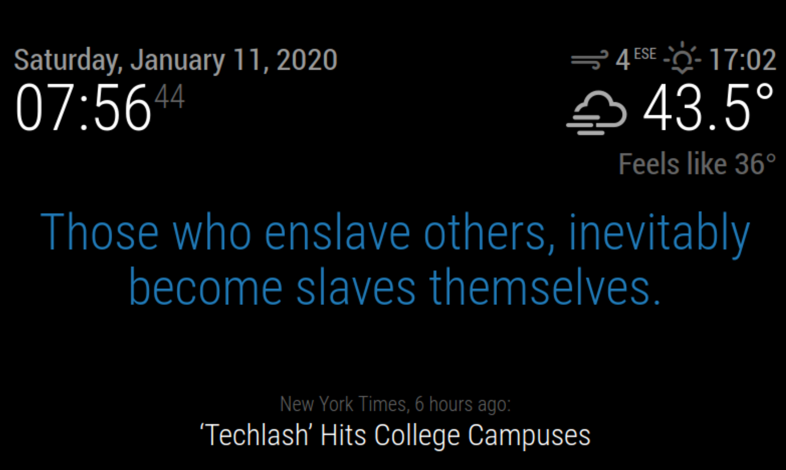

# Module: MMM-CloneWarsQuotes
The `MMM-CloneWarsQuotes` is a MagicMirror² module that displays a random intro quote (Jedi proverb) from _The Clone Wars_ television series, seasons 1-7.

## Screenshots
- MMM-CloneWarsQuotes Screenshot


## Using the module (default settings)

To use this module, add it to the modules array in the `config/config.js` file in the `~/MagicMirror` directory
````javascript
modules: [
	 {
		module: "MMM-CloneWarsQuotes",
		position: "middle_center",
		config: {}
	 }
]
````
The `MMM-CloneWarsQuotes` is a MagicMirror² module that displays a random intro quote (Jedi proverb) from _The Clone Wars_ television series, seasons 1-7.

## Screenshots
- MMM-CloneWarsQuotes Screenshot


## Using the module

To use this module, add it to the modules array in the `config/config.js` file in the `~/MagicMirror` directory:
````javascript
modules: [
	 {
		module: "MMM-CloneWarsQuotes",
		position: "middle_center",	// This can be any of the regions.
						// Best results in the middle regions: 
						// upper_third, middle_center, or lower_third
		config: {
			// The config property is optional.
			// If no config is set, the default quotes are shown randomly.
			// See 'Configuration options' for more information.
			quotes: [
				"This is the first quote",
				"This is the middle quote",
				"This is the last quote",
			],
			remoteFile: null, // set to null to use quotes config parameter
			classes: "bright large", // white text, large
			updateInterval: 60000, // 1 minute
			fadeSpeed: 2000, // 2 seconds
			random: false  // Show the quotes in the order listed.
		}
	}
]
````

## Configuration options

The following properties can be configured:


| Option           | Description
| ---------------- | -----------
| `quotes`	   | The array of quotes. The _remoteFile_ property must be `null` to use this property.<br><br> **Possible values:** An array of quote strings: See _Quotes Configuration_ below. <br><br> **Default value:** `[]`.
| `remoteFile`     | External file from which to load the quotes <br><br> **Possible values:** Path or URL (starting with `http://` or `https://`) to a JSON file containing an array of quotes, configured as per the _External Quotes File_ (see below). Set to `null` to use the _quotes_ config array property.<br> **Default value:** `MMM-CloneWarsQuotes.json`
| `classes`        | Override the CSS classes of the div showing the quotes <br><br> **Possible values:** A space separated list of MM2 classes: Found at `~/MagicMirror/css/main.css` and `MMM-CloneWarsQuotes.css` <br> **Default value:** `light blue medium large`
| `updateInterval` | How often does the quote have to change? (Milliseconds) <br><br> **Possible values:** `1000` - `86400000` (1 sec - 1 day) <br> **Default value:** `27000` (27 seconds)
| `fadeSpeed`      | Speed of the update animation. (Milliseconds) <br><br> **Possible values:**`0` - `5000` <br> **Default value:** `4000` (4 seconds)
| `random`         | Randomize the quotes <br><br> **Possible values:**`true` / `false` <br> **Default value:** `true`

### Quote Configuration

The `quotes` property contains an array of strings. The array contains one or multiple quotes.

#### Default configuration:
````javascript
config: {
	quotes: [],
	remoteFile: 'MMM-CloneWarsQuotes.json',
	classes: 'light blue medium large',
	updateInterval: 27000,
	fadeSpeed: 4000,
	random: true
}
````

### External Quotes File
You may specify an external file that contains the quotes arrays. This is particularly useful if you have a large number of quotes and do not wish to crowd your `config.js` file with a large array of quotes. Adding the `remoteFile` variable will override an array you specify in the configuration file. Set to `null` to use the quotes config array.

This file must be straight JSON.
#### Example quotes.json file:
````json
[
	"Great leaders inspire greatness in others.",
	"Belief is not a matter of choice, but conviction.",
	"Easy is the path to wisdom for those who are not blinded by themselves.",
]
````
